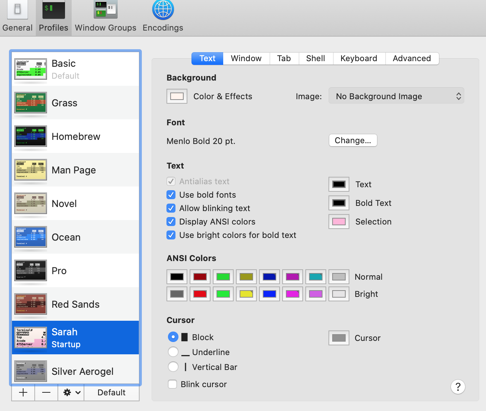

# Provisioning Snippets

Atom Snippets
```
'.source.js':
  'react commenting':
    'prefix': 'nn'
    'body': '{/* $1 */}'
  'console.log':
    'prefix': 'l'
    'body': 'console.log($1)'
  'for loop':
    'prefix': 'for'
    'body': """for(let i=0; i<$1.length; i++){

      }
      """
  'react class component':
    'prefix': 'react'
    'body':"""
      import React, { Component } from 'react'

      class $1 extends Component{
        render(){
          return(
            <React.Fragment>
            </React.Fragment>
          )
        }
      }
      export default $1
      """
```

.zshrc
```
# to know which specific one was loaded, run: echo $RANDOM_THEME
# See https://github.com/ohmyzsh/ohmyzsh/wiki/Themes
ZSH_THEME="af-magic"

# Set list of themes to pick from when loading at random
# Setting this variable when ZSH_THEME=random will cause zsh to load
# a theme from this variable instead of looking in ~/.oh-my-zsh/themes/
# If set to an empty array, this variable will have no effect.
# ZSH_THEME_RANDOM_CANDIDATES=( "robbyrussell" "agnoster" )


PROMPT_EOL_MARK="❤️"
# Which plugins would you like to load?
# Standard plugins can be found in ~/.oh-my-zsh/plugins/*
# Custom plugins may be added to ~/.oh-my-zsh/custom/plugins/
# Example format: plugins=(rails git textmate ruby lighthouse)
# Add wisely, as too many plugins slow down shell startup.
plugins=(git chucknorris)

source $ZSH/oh-my-zsh.sh

# User configuration
```





### Atom Config
`~/.atom/config.cson`
```
editor:
  fontSize: 20
  scrollPastEnd: true
  softWrap: true
  showIndentGuide: true
```
